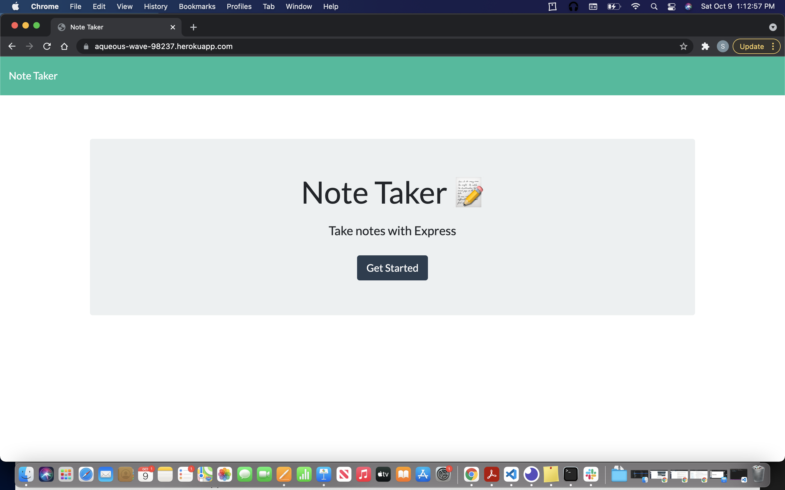
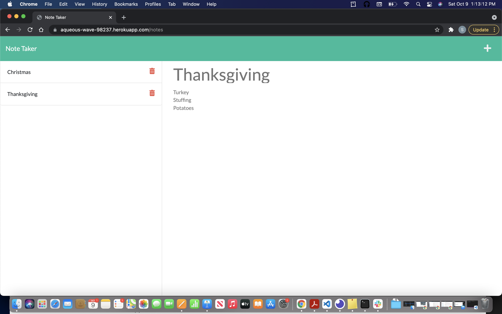

# Note Taker Application

## Description 

This application uses Javascript, Node.js, Express.js, uniqid.js, HTML and CSS to make a note taker app! The app creates notes. This app allows you to change notes. This app also allows you to delete the notes that you have created! When the notes are created, they are kept on the side of the app, to stay there for later use. Don't you just hate when you forget something at the store and you write it down on a piece of paper, only to lose it? With this app that can all change. 

To use this Note Taker application please visit: 
- [Note Taker App](https://aqueous-wave-98237.herokuapp.com/)
- [Github Repo](https://github.com/smurphy7326/note-taker)

## Table of Contents

* [Installation](#installation)
* [Usage](#usage)
* [Credits](#credits)
* [Technology](#technology)
* [License](#license)
* [Contact](#contact)

## Installation

To install this application:

1. Make sure node.js is installed on your computer. (https://nodejs.org/en/)

2. This projects Github repo, click on the green code button

3. Make sure you are on the SSH key.

4. Copy the link. 

5. Make sure you are in a new unused folder. Open Terminal.

6. Navigate to the new folder, and type in git clone. 

7. Navigate to the root of the folder, and type in 'npm install' which will download the necessary dependencies. 

## Usage 

1. Open Terminal or Gitbash and navigate to the root folder, 'note_taker'.

2. Type in the command 'npm start', this will open up the application on localhost:3001.

3. In whatever browser you use, type in the address bar "localhost:3001".

4. The application should be up and running. Hit the button at the center of the page and start writing things down.

## Credits 
For the starter code that was used for this is : https://github.com/coding-boot-camp/miniature-eureka

## Technology 

* Javascript
* Node.js
* Express.js
* HTML
* CSS

## License 

* MIT License

## Contact

- [Github](https://github.com/smurphy7326)
- [Email](mailto:smurphy7326@gmail.com)